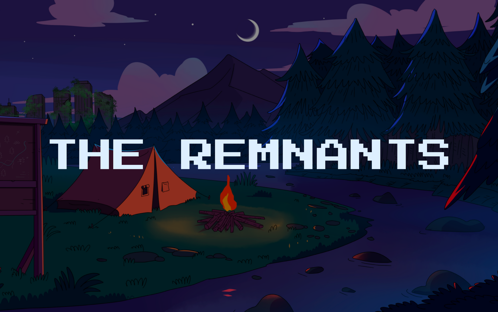

# The Remnants - P2E Utility and Ecosystem

## Official Links

**Website:** [https://theremnants.app/](https://theremnants.app/)

**Twitter:** [https://twitter.com/RemnantsNFT](https://twitter.com/RemnantsNFT)

**Discord:** [https://discord.gg/remnantsnft](https://discord.gg/remnantsnft)

## What is The Remnants?

The Remnants is an NFT project built on the Solana Blockchain. The NFT collection features 4000 post-apocalyptic survivors living within Longwood Valley. Unlike common PFP collections, The Remnants offer full body, human like pixel art. Each Remnant is your key to exploration within our ecosystem. The focus of our project is to provide utility and community driven Lore. From Loot Trips to 1v1 Battles, there is an array of utility available for all holders. Each Remnant is unique and is given a power rating based on its attributes and rarity. These attributes will influence your power within our platform. For example, a Remnant with a rare weapon may stand a higher chance of winning a battle against a Remnant of lower rarity. 

By holding a Remnant, you will become part of Longwood Valley DAO. Here, all holders will have influence over the future of our project and help the development team make decisions that best represent our community.

All Remnants holders will be able to earn our utility token $CAMP through Loot Trips and other utility covered in this Whitepaper. Alongside that, monthly rewards will be given out to top competitors in the Battle system. Our utility token will be used to interact with each Utility feature and will therefore be a valued asset throughout Longwood Valley.

### [WHITEPAPER](https://theremnants.notion.site/theremnants/The-Remnants-P2E-Utility-and-Ecosystem-afaebab1729c48f081959499a4e652f4)
